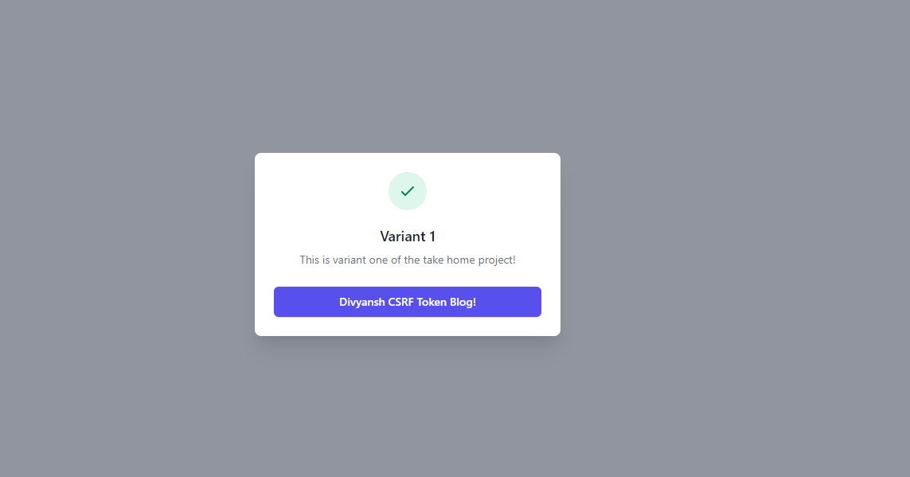
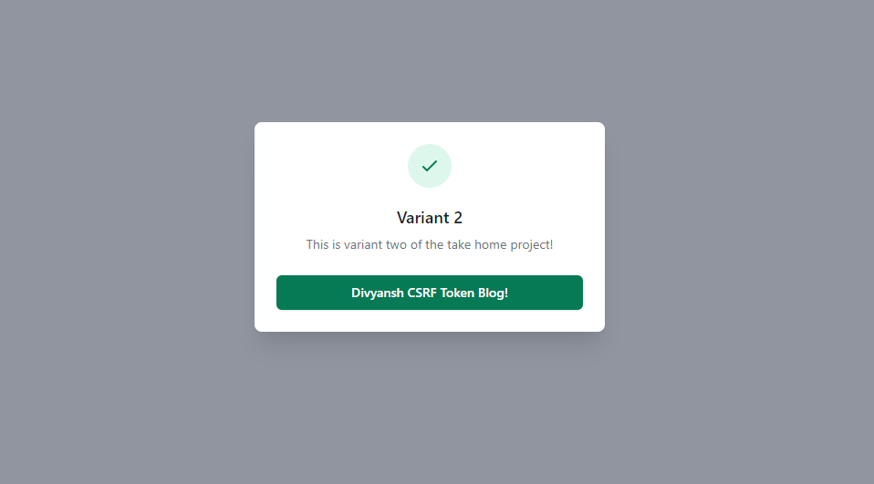
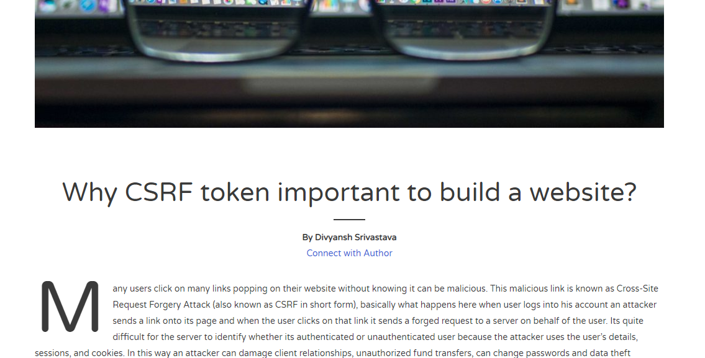

# Cloudflare-Internship-Task-2020
Deployed Link: https://cloudflare-divyansh-internship-work.divyanshsrivastava.workers.dev/


## This is the task given for cloudflare internship 2020

## Running the Project Locally

First, clone the repository to your local machine:

```bash
git clone https://github.com/9916103020/Cloudflare-Internship-Task-2020.git
```

Install the wrangler:

```bash
npm i @cloudflare/wrangler -g
```
## Note: you should have installed nvm first before using above command. If you haven't installed please follow below link: https://github.com/coreybutler/nvm-windows/releases 

Preview wrangler using your cmd

```bash
wrangler preview 
```
## Note: first reach to the directory where you have wrangler.toml


## Running on Cloudflare Website

Step 1: Sign Up to website using your email address and confirm your email address

Step 2: Go to Account Home from Menu Bar

Step 3: Click on Workers and make your workers.domain

Step 4: Now just go to your terminal and run below command to publish it

```bash
wrangler publish 
```

## Note: You have your account id pasted in wrangler.toml file and also used your gloabl api or created api. 

Some of the functionality of my used commands given below:

## 1. Fetch Command:
```bash
const url=await fetch('https://cfw-takehome.developers.workers.dev/api/variants')
await url.json()
```
It fetches json response from the above url.

## 2. Math.floor Command:
```bash
Math.floor(Math.random() * 2);
```
This command is used to perform desired functionality of giving 50% to both the variants.
## 3. HTML Rewriter Command:
```bash
new HTMLRewriter().on('a#url', new Request())
```

This is used to redirect to the desired html page after click to the variant button.

## 4. Replace command:
```bash
attribute.replace('cloudflare.com', 'cyberxploits.com/2019/08/16/csrf-token/')
```

Actually variant button was taking us to cloudfare website and I just used this command to redirect it to my blog.

# Some Snippets of the running project 

## Variant 1 Page



## Variant 2 Page



## After Click Redirect To My Blog Page

